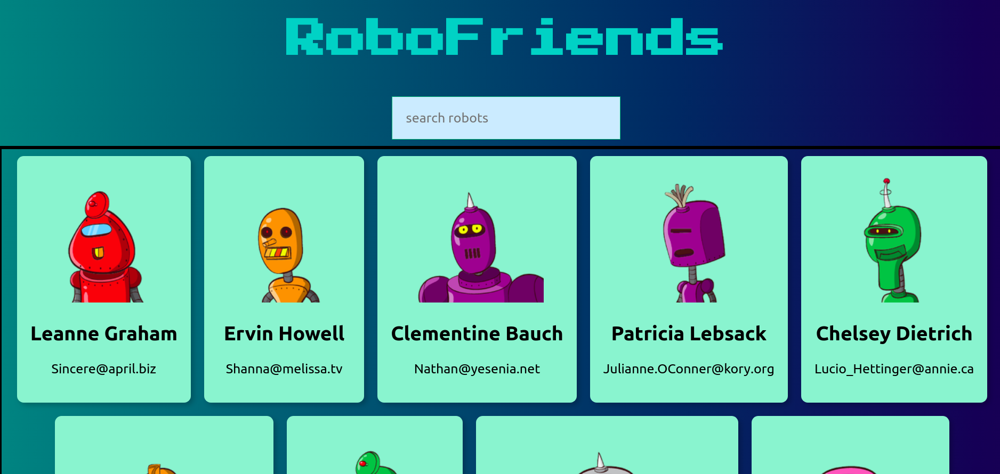

# Robo Friends

React rehab part 1 - Robot search engine



## Getting Started

Clone this repository (SSH)
```
git clone git@github.com:DrCardamom/roboFriends.git
```

Clone this repository (HTTPS)
```
git clone https://github.com/DrCardamom/roboFriends.git
```

Install dependencies
```
npm install 
```

Run the program
```
npm start
```


## Built With

* [React](http://www.dropwizard.io/1.0.2/docs/) 
* [Redux](https://redux.js.org/) 
* [Tachyons](https://tachyons.io/) - Css toolkit
